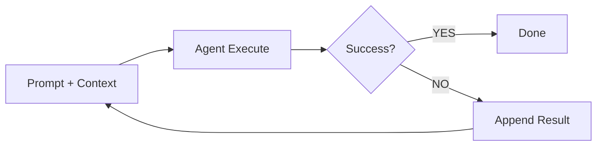
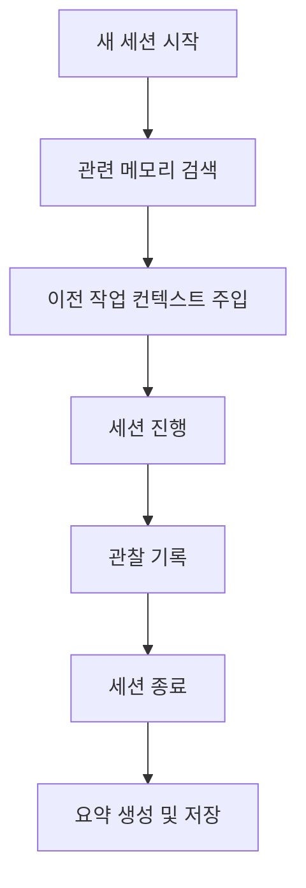
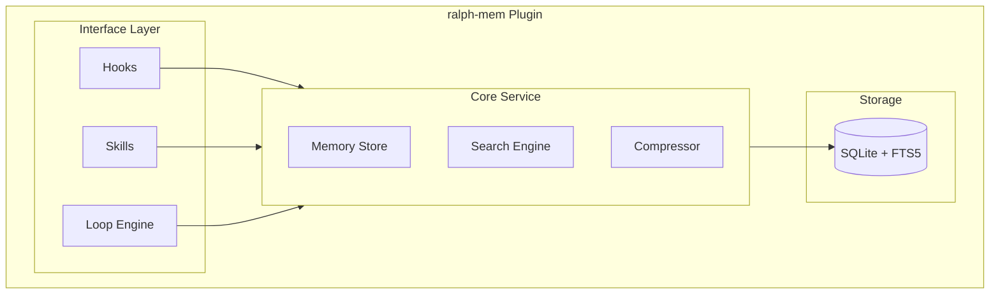

# ralph-mem

[](https://www.npmjs.com/package/ralph-mem)
[](https://opensource.org/licenses/MIT)
[](https://www.typescriptlang.org/)
[](https://bun.sh/)

Claude Code를 위한 Ralph Loop 기반 지속적 컨텍스트 관리 플러그인

## 개요

ralph-mem은 [Geoffrey Huntley](https://ghuntley.com/)의 [Ralph Loop](https://ghuntley.com/ralph/)와 [thedotmack](https://github.com/thedotmack)의 [claude-mem](https://github.com/thedotmack/claude-mem)에서 영감을 받아 시작된 프로젝트입니다.

Ralph Loop의 "성공할 때까지 반복" 철학과 claude-mem의 "지능적 컨텍스트 관리"를 결합하여 Claude Code를 위한 지속적 메모리 관리 플러그인을 구현했습니다.

### 해결하는 문제

| 문제              | 설명                                         |
| ----------------- | -------------------------------------------- |
| **Context Rot**   | 누적된 불필요한 정보로 인한 모델 성능 저하   |
| **Compaction**    | context window 60-70% 초과 시 출력 품질 급락 |
| **Forgetfulness** | 세션 간 작업 맥락 손실                       |
| **One-shot 실패** | 복잡한 작업에서 단일 시도 성공률 저조        |

## 핵심 기능

### 1. Ralph Loop Engine

성공 기준 달성까지 자동으로 반복 실행합니다.

```bash
/ralph start "Add user authentication with JWT"
```



**지원하는 성공 기준:**

- `test_pass` - 테스트 통과 (`npm test`, `pytest`)
- `build_success` - 빌드 성공
- `lint_clean` - Lint 오류 없음
- `type_check` - 타입 체크 통과
- `custom` - 사용자 정의 명령

### 2. Persistent Memory

세션 간 컨텍스트를 자동으로 저장하고 복원합니다.



**Lifecycle Hooks:**

- `SessionStart` - 관련 메모리 자동 주입
- `PostToolUse` - 도구 사용 결과 기록
- `SessionEnd` - 세션 요약 생성 및 저장

### 3. Progressive Disclosure

토큰 효율적인 3계층 검색으로 약 10배 토큰 절약:

| Layer   | 내용                       | 토큰            |
| ------- | -------------------------- | --------------- |
| Layer 1 | Index (ID + 점수)          | 50-100/result   |
| Layer 2 | Timeline (시간순 컨텍스트) | 200-300/result  |
| Layer 3 | Full Details               | 500-1000/result |

```bash
/mem-search "authentication error"           # Layer 1
/mem-search --layer 3 obs-a1b2               # Layer 3
```

## 설치

### npm

```bash
npm install ralph-mem
```

### yarn

```bash
yarn add ralph-mem
```

### pnpm

```bash
pnpm add ralph-mem
```

### bun

```bash
bun add ralph-mem
```

### Claude Code 플러그인

```bash
claude plugins install ralph-mem
```

## 사용법

### Ralph Loop

```bash
# Loop 시작 (기본: 테스트 통과까지)
/ralph start "Implement feature X"

# 커스텀 성공 기준으로 시작
/ralph start "Fix lint errors" --criteria lint_clean

# Loop 상태 확인
/ralph status

# Loop 중단
/ralph stop
```

### Memory 검색

```bash
# 키워드 검색
/mem-search "JWT authentication"

# 특정 관찰 상세 조회
/mem-search --layer 3 <observation-id>

# 시간 범위 검색
/mem-search "database" --since 7d
```

### Memory 관리

```bash
# 메모리 상태 확인
/mem-status

# 수동 컨텍스트 주입
/mem-inject "이 프로젝트는 Express + Prisma 기반"

# 특정 메모리 제거
/mem-forget <observation-id>
```

## 설정

`~/.config/ralph-mem/config.yaml`:

```yaml
ralph:
  max_iterations: 10          # 최대 반복 횟수
  context_budget: 0.6         # context window 사용률 상한
  cooldown_ms: 1000           # 반복 간 대기 시간
  success_criteria:
    - type: test_pass
      command: "npm test"

memory:
  auto_inject: true           # 세션 시작 시 자동 주입
  max_inject_tokens: 2000     # 주입 최대 토큰
  retention_days: 30          # 메모리 보관 기간

privacy:
  exclude_patterns:           # 저장 제외 패턴
    - "*.env"
    - "*password*"
    - "*secret*"
```

## 아키텍처



## 프로젝트 구조

```text
ralph-mem/
├── src/
│   ├── hooks/           # Lifecycle hooks
│   ├── skills/          # Slash commands
│   ├── loop/            # Ralph Loop engine
│   ├── memory/          # Memory store & search
│   └── db/              # SQLite + FTS5
├── prompts/             # AI 프롬프트
├── docs/
│   └── PRD.md           # Product Requirements
└── tests/
```

## 기술 스택

- **Runtime**: Bun
- **Language**: TypeScript
- **Database**: SQLite + FTS5
- **Testing**: Vitest

## 개발

```bash
# 의존성 설치
bun install

# 개발 모드
bun run dev

# 테스트
bun test

# 빌드
bun run build
```

## 참고 자료

- [Ralph Loop - Geoffrey Huntley](https://ghuntley.com/ralph/)
- [claude-mem](https://github.com/thedotmack/claude-mem)
- [Inventing the Ralph Wiggum Loop (Podcast)](https://linearb.io/dev-interrupted/podcast/inventing-the-ralph-wiggum-loop)
- [The Brief History of Ralph](https://www.humanlayer.dev/blog/brief-history-of-ralph)

## 라이선스

MIT
